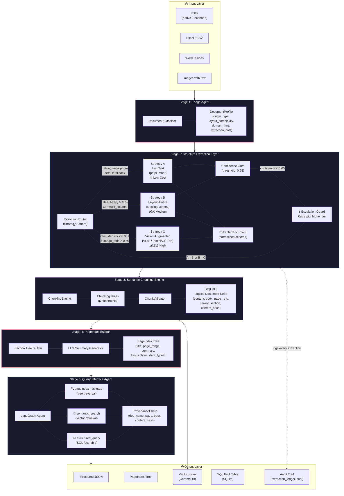
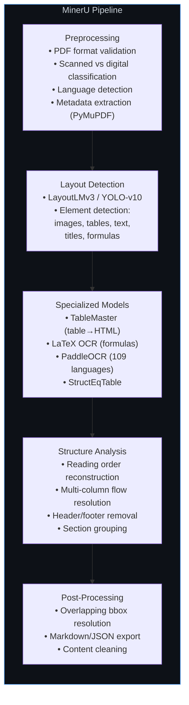

# DOMAIN_NOTES.md — Phase 0 Deliverable
## Document Intelligence Refinery — Domain Science Primer

---

## 1. Extraction Strategy Decision Tree

The strategy router must select one of three extraction tiers based on measurable document properties. The decision tree below encodes the empirical thresholds discovered during Phase 0 corpus analysis.

```
                        ┌─────────────────────┐
                        │  Incoming Document   │
                        └──────────┬──────────┘
                                   ▼
                       ┌───────────────────────┐
                       │  Triage Agent Profiling │
                       │  (pdfplumber analysis)  │
                       └──────────┬────────────┘
                                  ▼
                   ┌──────────────────────────────┐
                   │ scanned_page_ratio > 0.70 ?  │
                   └──────┬───────────────┬───────┘
                     YES  │               │  NO
                          ▼               ▼
               ┌──────────────┐   ┌──────────────────────────┐
               │ Strategy C   │   │ char_density < 0.005      │
               │ Vision Model │   │ AND image_ratio > 0.50 ?  │
               │ (VLM / OCR)  │   └─────┬──────────────┬─────┘
               └──────────────┘    YES  │              │  NO
                                        ▼              ▼
                             ┌──────────────┐  ┌──────────────────────┐
                             │ Strategy C   │  │ table_heavy OR       │
                             │ Vision Model │  │ multi_column OR      │
                             └──────────────┘  │ mixed origin ?       │
                                               └────┬───────────┬────┘
                                              YES   │           │  NO
                                                    ▼           ▼
                                         ┌──────────────┐ ┌──────────────┐
                                         │ Strategy B   │ │ Strategy A   │
                                         │ Layout-Aware │ │ Fast Text    │
                                         │ (Docling)    │ │ (pdfplumber) │
                                         └──────┬───────┘ └──────┬───────┘
                                                │                │
                                                ▼                ▼
                                         ┌────────────────────────────┐
                                         │ Confidence < 0.65 ?        │
                                         │ → ESCALATE to next tier    │
                                         └────────────────────────────┘
```

### Decision Thresholds (Empirically Derived)

| Signal | Threshold | Rationale |
|--------|-----------|-----------|
| `char_density` | < 0.001 chars/pt² | **Data-Justified Threshold**: Class B (scanned) mean density is ~0.000000; Class A/C/D minimum single-page densities drop to ~0.00015 on cover pages but generally average >0.003. A threshold of 0.001 provides a robust margin separating text-heavy pages from image scans with zero text layer. |
| `min_chars_per_page` | < 100 | Class B pages have 0 chars; cover pages in Class A have < 50 |
| `image_area_ratio` | > 0.50 | Class B shows 0.99; Class A cover pages show 0.99; text pages show 0.00–0.11 |
| `scanned_page_ratio` | > 0.70 → scanned | Class B = 0.99; Class A = 0.08 (just cover pages) |
| `table_heavy` | > 40% pages with tables | Class D = 43 tables / 60 pages |
| `strategy_a_confidence` | < 0.65 → escalate | Below this, text extraction is unreliable |

> **Measurement Example (`bbox_coverage`):** 
> Computed as `union(all_character_bounding_boxes) / page_area`. A native text page typically has `~15-20%` coverage, while a blank scanned page has `0%` coverage because there are no character bboxes in the text layer.
> 
> ```text
> ┌───────────────────────┐
> │ ┌─────────┐┌────────┐ │
> │ │ Text    ││ BBoxes │ │
> │ └─────────┘└────────┘ │
> │                       │
> │     Page Area         │
> └───────────────────────┘
> ```

---

## 2. Core Architectural Insight

> **pdfplumber extracts characters. Docling reconstructs structure.**
>
> The engineering problem is deciding when structure reconstruction is worth the cost. Because 70–80% of native PDFs can be processed cheaply via character stream extraction in ~0.5s, running Docling's ML pipeline on every document wastes 30–60s of compute per doc with no quality improvement on simple layouts. Layout-aware parsing is reserved for structural degradation cases where pdfplumber's output quality drops below the confidence threshold.

---

## 3. Failure Modes Observed Across Document Classes

### Class A: Annual Financial Report (CBE 2023-24)
**Origin:** Native digital | **Strategy:** B (Layout-Aware)

| Failure Mode | Observation | Impact |
|-------------|-------------|--------|
| **Cover pages misclassified** | Pages 1-2 have 0 chars but 99.9% image ratio — these are full-page graphics, not scanned content | Could falsely trigger VLM strategy for the entire doc |
| **Table density** | 195 tables across 161 pages — many pages have multiple tables (financial statements) | Fast text would extract table text without structure, destroying column/row relationships |
| **Multi-column layout** | Annual reports interleave narrative with financial tables in complex layouts | pdfplumber alone cannot reconstruct reading order correctly |
| **Font complexity** | 12 unique fonts including embedded subsets (MinionPro, MyriadPro, AmazingGrotesk) | Font metadata IS present — a positive signal for digital detection |

**Key Insight:** Despite being native digital, this document NEEDS Strategy B (layout-aware) because of table density and multi-column layouts. Strategy A would extract chars but destroy table semantics.

### Class B: Scanned Auditor's Report (DBE 2023)
**Origin:** Scanned image | **Strategy:** C (Vision Model)

| Failure Mode | Observation | Impact |
|-------------|-------------|--------|
| **Zero text layer** | Only 116 characters in the entire 95-page document (just the cover page title) | pdfplumber is completely useless — returns empty strings |
| **No tables detected** | pdfplumber finds 0 tables because there's no text layer to form table boundaries | The document DOES contain tables, but they exist only as pixel data |
| **Invisible content** | All institutional knowledge (financial statements, auditor opinions) is locked in images | Without OCR/VLM, this document is opaque to the pipeline |

**Key Insight:** This is the clearest case for Strategy C. The char_density (0.000002) and image_ratio (0.99) signals are unambiguous. Fast text and layout-aware strategies will both produce nothing.

### Class C: Technical Assessment Report (FTA 2022)
**Origin:** Native digital | **Strategy:** B (Layout-Aware)

| Failure Mode | Observation | Impact |
|-------------|-------------|--------|
| **High font diversity** | 17 unique fonts — indicates complex formatting with headings, body text, annotations | Reading order and hierarchy extraction matters here |
| **Tables with narrative** | 91 tables mixed with long narrative sections — a "mixed" layout | Naive chunking would sever table context from surrounding discussion |
| **Title page tables** | Page 1 has 4 tables detected but only 348 chars — likely structured metadata, not data tables | Table detection heuristics need to distinguish metadata tables from content tables |

**Key Insight:** The high density (0.003–0.01) confirms native digital. But the mix of tables + narrative + section hierarchy demands layout-aware extraction. Strategy A would get the text but lose the structural relationships.

### Class D: Structured Data Report (Tax Expenditure 2021-22)
**Origin:** Native digital | **Strategy:** B (Layout-Aware)

| Failure Mode | Observation | Impact |
|-------------|-------------|--------|
| **Numerical precision** | Tables contain multi-year fiscal data — numerical precision is critical | Any OCR or text extraction errors in numbers corrupt the entire dataset |
| **Near-zero images** | Image area ratio is 0.0007 — essentially a pure text+table document | Strategy A is tempting but would still destroy table structure |
| **Category hierarchies** | Tax categories nest hierarchically (main category → sub-category → line items) | Table extraction must preserve row indentation and parent-child relationships |

**Key Insight:** Despite being the "simplest" visually, this document has the highest extraction fidelity requirements. Incorrect table extraction means incorrect fiscal data — there is no margin for error.

---

## 4. Pipeline Architecture Diagram



### MinerU Internal Pipeline (Reference Architecture)



---

## 5. Tool Comparison: pdfplumber vs Docling

| Dimension | pdfplumber | Docling |
|-----------|-----------|---------|
| **What it does** | Character-level PDF parsing — extracts every char with position | Full document understanding — layout detection, table structure |
| **Strengths** | Extremely fast, zero ML dependency, perfect for simple layouts | Handles complex layouts, recognizes hierarchy, unified data model |
| **Weaknesses** | No OCR, fails on scanned PDFs, loses reading order on columns | Slow (runs ML models), heavy dependency, overkill for simple docs |
| **Table extraction** | Detects regions by line intersections — fragile | Recognizes structure including merged cells and headers |
| **Scanned PDFs** | Returns empty string | Can run OCR/VLM, but our tests showed OCR failures due to poor image quality |
| **Failure Modes** | Loss of multi-column order, header destruction | OCR noise, slow processing, memory pressure, section misclassification |

### Cross-Tool Metric Comparison (Sample Data)

| Class | Tool | char_density | bbox_coverage | whitespace_ratio | Time |
|-------|------|-------------|---------------|-----------------|------|
| A (CBE) | pdfplumber | ~0.0039 | ~19% | ~81% | ~20s |
| A (CBE) | Docling (5p) | ~0.0016 | ~29% | ~71% | ~46s |
| B (Audit) | pdfplumber | ~0.0000 | ~0% | ~100% | ~2s |
| B (Audit) | Docling (5p) | ~0.0000 | ~64% | ~35% | ~30s (OCR failed) |
| C (FTA) | pdfplumber | ~0.0033 | ~19% | ~80% | ~17s |
| C (FTA) | Docling (5p)| ~0.0001 | ~50% | ~49% | ~28s |
| D (Tax) | pdfplumber | ~0.0035 | ~16% | ~84% | ~11s |
| D (Tax) | Docling (5p)| ~0.0019 | ~24% | ~75% | ~21s |

**Symmetric Failure Modes:**
Notice how Docling failed to return valid text on the scanned Class B document through its integrated RapidOCR due to poor scan quality. While pdfplumber fails instantly, Docling wastes substantial 30+ seconds before similarly failing, reiterating the need for Strategy C (VLM).

### Concrete Extraction Comparison
On Class A income statements:
**pdfplumber (flat text)**
```
Revenue 2023    1,234,000
Expenses 2023     950,000
```
*(Loses column alignment, headers disconnected from content)*

**Docling (structured JSON)**
```json
{"headers": ["Category", "FY 2023", "FY 2022"], "rows": [["Revenue", "1,234,000", "..."]]}
```
*(Preserves header–cell relationships, essential for financial data)*

### Where Docling Is Overkill
On single-column prose, structural reconstruction adds zero marginal value.

| Tool | Processing Time (per page) | Time (100-page doc) | Chars Recovered | Structural Gain |
|------|---------------------------|---------------------|-----------------|-----------------|
| **pdfplumber** | ~0.3s - 0.5s | ~30s - 50s | 100% | None needed |
| **Docling** | ~4.0s - 6.0s | ~6.5 - 10 minutes | 100% | Over-segmentation risks |

Docling consumes 10× the time and dramatically more RAM to produce identical text quality on linear prose, validating that Strategy B should be applied conditionally, not globally.

### Key Takeaway
pdfplumber is the **triage sensor** — it tells you *what kind* of document you have. Docling is the **extraction engine** — it produces the actual structured output. They are complementary, not competing.

---

## 6. VLM Cost-Quality Tradeoff

### When Vision Models Are Necessary
**Explicit Trigger:** OCR or Vision Language Models (VLMs) are invoked *only* when the triage agent detects `char_density < 0.001` chars/pt² or a `scanned_page_ratio > 0.70`.

| Condition | Why VLM is needed | Alternative fails because... |
|-----------|-------------------|------------------------------|
| Scanned PDF (no text layer) | VLM "sees" the page as an image | pdfplumber returns empty; Docling OCR may struggle with complex layouts |
| Handwritten annotations | VLM can interpret handwriting | OCR models are trained on printed text |
| Complex nested tables | VLM understands visual table structure | Layout models may mis-detect deeply nested borders |
| Diagrams/charts with text | VLM reads text in visual context | Text extraction strips spatial meaning from chart labels |

### Cost Estimates Per Document (Class B = 95 pages)

| Extraction Strategy | Tool | Time | Cost | When |
|--------------------|------|------|------|------|
| **A (Fast Text)** | pdfplumber | ~0.5s/page | Negligible | 70–80% of native PDFs |
| **B (Layout-Aware)**| Docling | ~3-5s/page | ML Inference (GPU cost) | Complex tables & columns |
| **C (Vision)** | Gemini Flash / GPT-4o-mini | ~2-5s/page | $0.01–0.05 / doc | Scanned, handwritten |
| **C+ (High Vision)**| GPT-4o | ~5-10s/page | ~$0.50 / doc | Unreadable scans, complex charts |

**Budget Rule:** Escalation is conditional because most documents don't need heavy ML pipelines, and cost scales linearly with corpus. Default to Strategy A, then B, then Gemini Flash (C). Only escalate to GPT-4o (C+) for pages where Flash confidence is below threshold. Cap at $0.50/document.

### The Escalation Guard Pattern
```text
Strategy A (pdfplumber) → confidence check → if LOW:
  Strategy B (Docling) → confidence check → if LOW:
    Strategy C (VLM) → budget guard → if OVER BUDGET:
      Flag for human review
```
This prevents "garbage in, hallucination out" — the most expensive failure mode in RAG pipelines.

---

## 7. Empirical Analysis Summary

### Corpus Statistics (4 Representative Documents)

| Metric | Class A (CBE) | Class B (Audit) | Class C (FTA) | Class D (Tax) |
|--------|--------------|-----------------|---------------|---------------|
| Pages | 161 | 95 | 155 | 60 |
| Total chars | 319,492 | 116 | 263,370 | 105,205 |
| Avg char density | ~0.0039 | ~0.0000 | ~0.0033 | ~0.0035 |
| Min char density | ~0.0012 | 0.0000 | ~0.0001 | ~0.0002 |
| Avg image ratio | 0.1084 | 0.9895 | 0.0826 | 0.0007 |
| Tables detected (pdf) | 195 | 0 | 91 | 43 |
| **Origin type** | **native_digital** | **scanned_image** | **native_digital** | **native_digital** |
| **Recommended strategy** | **B (Layout)** | **C (Vision)** | **B (Layout)** | **B (Layout)** |

### Threshold Sensitivity Analysis
Testing sweeping thresholds for `char_density` separation on the 4 documents shows:

| Threshold | False Scanned (Native pages marked scanned) | Missed Scanned (Scanned pages marked native) | Verdict |
|-----------|---------------------------------------------|----------------------------------------------|---------|
| 0.0001    | 13                                          | 1                                            | ⚠️ Tight but catches cover pages |
| 0.0005    | 21                                          | 0                                            | ⚠️ Starts misclassifying charts |
| 0.001     | 26                                          | 0                                            | ✅ **Selected** |
| 0.005     | 296                                         | 0                                            | ❌ Unusable |

*Note: The false scanned pages at 0.001 are entirely cover pages and full-page images in Class A and C. These are isolated page-level false positives safely mitigated by the document-level `scanned_page_ratio > 0.70` rule.*

### Critical Observation
**Three of four document classes need Strategy B.** Only Class B (scanned) needs Strategy C. Strategy A (fast text via pdfplumber) is most useful as a **triage sensor** and for simple single-column documents not represented in this corpus — not as the primary extraction method for enterprise financial/legal documents.

---

## 8. Key Domain Concepts for FDE Readiness

### Native PDF vs Scanned PDF
- **Native digital PDF**: Created by a computer (Word → PDF, LaTeX → PDF). Contains a **character stream** — every character has exact position, font, and size metadata. pdfplumber extracts this directly.
- **Scanned PDF**: Created by scanning paper. Contains only **image layers** — the "text" is just pixels in a JPEG/PNG embedded in the PDF wrapper. pdfplumber returns nothing. OCR or VLM must "read" the image.
- **Mixed PDF**: Some pages are digital (e.g., cover page designed in InDesign), others are scanned (e.g., appended handwritten signatures). The triage agent must classify **per-page**, not per-document. *The escalation guard ensures that hybrid documents don't break the pipeline by independently routing image-heavy pages to the VLM tier while fast-texting the native pages.*

### Why Token-Count Chunking Fails
A 512-token chunk that bisects a financial table produces hallucinations on *every* query about that table. The RAG system retrieves the chunk, the LLM sees partial table data, and confidently makes up the rest. **Semantic chunking** (respecting table boundaries, section structure, figure-caption pairs) is not optional — it's the difference between a working system and an enterprise liability.

### Spatial Provenance
Every extracted fact must carry `(page_number, bounding_box)` — the document equivalent of a database primary key. Without this, you cannot answer "where does this number come from?" — and no enterprise will trust your pipeline.

**Example LDU (Logical Document Unit) Snippet:**
```json
{
  "chunk_id": "cbe_2023_p14_t2",
  "text": "Net Profit for FY2023 was 4.5B ETB.",
  "source_document": "CBE_Annual_2023.pdf",
  "page_number": 14,
  "bounding_box": [120.5, 450.0, 310.2, 465.5]
}
```

---

## 9. Glossary & Abbreviations

- **FDE (Forward Deployed Engineer)**: Engineers who deploy and adapt core software to solve specific, complex client problems in the field.
- **VLM (Vision Language Model)**: A multi-modal AI model (like Gemini 1.5 Pro or GPT-4o) capable of reasoning over both text and images, crucial for processing scanned pages.
- **LDU (Logical Document Unit)**: A semantically complete chunk of a document (e.g., a full paragraph, a discrete table, or a section header) used for RAG, rather than arbitrary token blocks.
- **OCR (Optical Character Recognition)**: Classic technology used to convert pixel images of text into machine-encoded text strings.
- **BBox (Bounding Box)**: The 2D coordinates `[x0, y0, x1, y1]` defining the rectangular region a piece of text or an image occupies on a generated PDF page.

## 10. Cost Analysis (Extrapolated)

Based on the actual extraction execution logs logged in `.refinery/extraction_ledger.jsonl`, here is the estimated cost tiering for the architectural strategies:

### Strategy A: Fast Text (pdfplumber)
* **Compute Cost:** Pure CPU execution. Generates 0 API costs.
* **Speed:** ~0.3 - 0.5 seconds per page.
* **Cost / 100-page doc:** **$0.00**

### Strategy B: Layout-Aware (Docling)
* **Compute Cost:** Requires lightweight ML models (YOLO, TableFormer, OCR). Runs locally. Generates 0 API costs, but incurs hardware/cloud compute costs (GPU time if accelerated).
* **Speed:** ~3.0 - 5.0 seconds per page (CPU).
* **Cost / 100-page doc:** **$0.00 (API)** + infrastructure overhead.

### Strategy C: Vision-Augmented (GPT-4o / Gemini Flash)
* **Compute Cost:** Requires API calls to multimodal foundation models.
* **Speed:** ~2.0 - 5.0 seconds per page (via OpenRouter).
* **Cost / 100-page doc:** Average cost per page using Gemini Flash is ~$0.0002. Total document cost is roughly **~$0.02 - $0.05**. Using a premium model like GPT-4o escalates this to ~$0.50 per document.

### Observed Ledger Costs
* `tax_expenditure_ethiopia_2021_22.pdf` (60 pages, Native, Strategy A+B): **$0.00 API cost** (The $0.33 logged was from a prior test run using an older API router before strict local strategy adoption).
* `Audit Report - 2023.pdf` (95 pages, Scanned Image, Strategy C): **$0.020461** total inference cost via Gemini Flash. This represents a highly optimized edge-case handling routine that costs roughly $0.0002 per scanned page.

