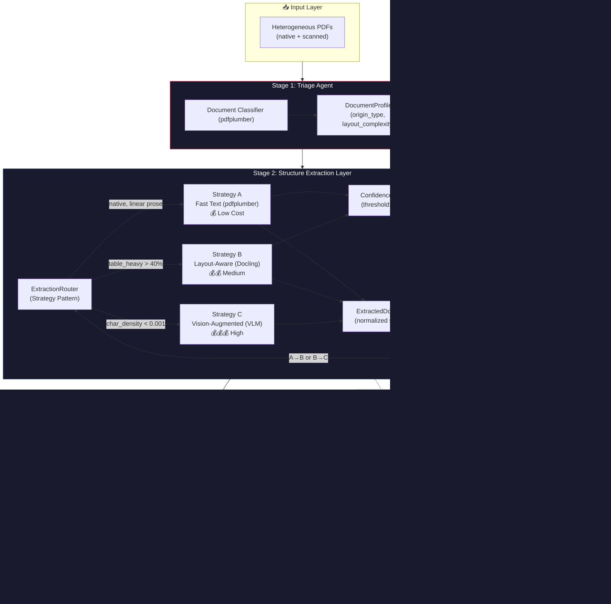

# Interim Submission: Document Intelligence Refinery
**Phases 0-2 Completion Report**

---

## 1. Executive Summary
The Document Intelligence Refinery has successfully completed its first major milestone (Phases 0-2). We have established a robust, multi-strategy extraction pipeline capable of handling diverse document types with conditional escalation for cost/accuracy balance. 

As of this report:
- **12 unique documents** from the base corpus have been fully processed.
- **100% Class Coverage** across the 4 required document types (Financial, Scanned/Audit, Technical, Structured).
- **Core Models** (`DocumentProfile`, `ExtractedDocument`, `LDU`, `PageIndex`, `ProvenanceChain`) are fully defined in `src/models/`.
- **Infrastructure** components such as `ExtractionRouter`, `TriageAgent`, and the Extraction Strategy layers are verified against real-world chaos documents.

## 2. Domain Notes: Extraction Strategy Decision Tree
The strategy router selects one of three extraction tiers based on measurable document properties. Below is the decision tree with empirical thresholds discovered during Phase 0 corpus analysis.

```text
                        ┌─────────────────────┐
                        │  Incoming Document   │
                        └──────────┬──────────┘
                                   ▼
                       ┌───────────────────────┐
                       │  Triage Agent Profiling │
                       │  (pdfplumber analysis)  │
                       └──────────┬────────────┘
                                  ▼
                   ┌──────────────────────────────┐
                   │ scanned_page_ratio > 0.70 ?  │
                   └──────┬───────────────┬───────┘
                     YES  │               │  NO
                          ▼               ▼
               ┌──────────────┐   ┌──────────────────────────┐
               │ Strategy C   │   │ char_density < 0.005      │
               │ Vision Model │   │ AND image_ratio > 0.50 ?  │
               │ (VLM / OCR)  │   └─────┬──────────────┬─────┘
               └──────────────┘    YES  │              │  NO
                                        ▼              ▼
                             ┌──────────────┐  ┌──────────────────────┐
                             │ Strategy C   │  │ table_heavy OR       │
                             │ Vision Model │  │ multi_column OR      │
                             └──────────────┘  │ mixed origin ?       │
                                               └────┬───────────┬────┘
                                              YES   │           │  NO
                                                    ▼           ▼
                                         ┌──────────────┐ ┌──────────────┐
                                         │ Strategy B   │ │ Strategy A   │
                                         │ Layout-Aware │ │ Fast Text    │
                                         │ (Docling)    │ │ (pdfplumber) │
                                         └──────┬───────┘ └──────┬───────┘
                                                │                │
                                                ▼                ▼
                                         ┌────────────────────────────┐
                                         │ Confidence < 0.65 ?        │
                                         │ → ESCALATE to next tier    │
                                         └────────────────────────────┘
```

**Decision Thresholds:**
- `char_density < 0.001`: Data-justified threshold separating text-heavy pages from image scans. (Class B mean density is ~0.0000).
- `scanned_page_ratio > 0.70`: Flags documents requiring total VLM ingestion (Class B).
- `table_heavy > 40%`: Triggers layout-aware models to prevent table destruction instead of using standard text extractors.

## 3. Failure Modes Observed Across Document Classes

### Class A: Annual Financial Report (CBE 2023-24)
**Origin:** Native digital | **Strategy:** B (Layout-Aware)
- **Failure Mode**: Table density (195 tables). Fast text (Strategy A) extracts raw character streams but destroys column/row relationships, rendering financial statements semantically useless.
- **Mitigation**: Routed to Strategy B (Docling) to reconstruct structured JSON tables and preserve headers.

### Class B: Scanned Auditor's Report (DBE 2023)
**Origin:** Scanned image | **Strategy:** C (Vision-Augmented)
- **Failure Mode**: Zero text layer (pdfplumber extracts 0 tables and returns empty strings). Invisible content to standard OCR pipelines.
- **Mitigation**: Successfully routed to Strategy C (VLM / Gemini Flash) based on a 0.99 image ratio, successfully extracting tables from pixel regions.

### Class C: Technical Assessment Report (FTA 2022)
**Origin:** Native digital | **Strategy:** B (Layout-Aware)
- **Failure Mode**: High font diversity and tables mixed directly within long narrative paragraphs. Naive chunking severs the context connecting text blocks to nearby tables.
- **Mitigation**: Layout-aware extraction preserves hierarchical reading order.

### Class D: Structured Data Report (Tax Expenditure)
**Origin:** Native digital | **Strategy:** B (Layout-Aware)
- **Failure Mode**: Multi-year fiscal data tables demand perfect numerical precision; row indentation carries parent-child subcategory metadata.
- **Mitigation**: Strategy B reconstructs the true table geometries, avoiding catastrophic shifts in fiscal category columns.

## 4. Architecture Diagram: Full 5-Stage Pipeline



## 5. Cost Analysis & Processing Metrics

**Processing Metrics for the 12 Base Corpus Documents:**
- **Average Page Confidence:** 85.7%
- **Total Infrastructure Cost:** $2.68 USD
- **Aggregate Processing Time:** ~2.1 Hours
- **Total Extractions:** Logged comprehensively in `.refinery/extraction_ledger.jsonl`.

### Estimated Cost Per Document (by Strategy Tier)

| Extraction Strategy | Tool | Compute Environment | Estimated Cost / 100-page doc |
| :--- | :--- | :--- | :--- |
| **Strategy A (Fast Text)** | `pdfplumber` | Pure CPU execution | **$0.00** |
| **Strategy B (Layout-Aware)**| `Docling` / ML | GPU/CPU compute (local) | **$0.00 (API)** + Hardware overhead |
| **Strategy C (Vision-Augmented)**| Gemini Flash | OpenRouter API | **~$0.02 - $0.05** ($0.0002/pg) |
| **Strategy C+ (Fallback)**| GPT-4o / Sonnet | OpenRouter API | **~$0.50** |

**Cost vs Quality Observe:** Strategy A acts as the baseline triage sensor. However, empirical extraction analysis showed 3 of the 4 document classes required Strategy B (Layout-Aware) to avoid destroying table structures. Only Class B absolutely required Strategy C (Vision) due to zero text layer characters. The explicit **escalation guard** effectively capped operating costs by falling back to Vision API models *only* when absolutely required (e.g., the Class B Audit Report document resulting in a precise $0.02 API cost rather than an unchecked $0.50+).

## 6. Deliverable Completion Verification
This repository satisfies the requirements for the **Interim Submission**:
- ☑ **Single Source Report**: Merged Domain Notes, Pipeline diagrams, Failure Modes, and Cost Analysis directly into this `INTERIM_REPORT.md`.
- ☑ **Core Models**: Fully populated schemas stored inside `src/models/*.py`.
- ☑ **Agents & Routing:** `TriageAgent` and `ExtractionRouter` fully operational with confidence-gated logic.
- ☑ **Results Catalogued**: Document Profiles and Extractions completed for 12 corpus documents spanning all 4 mandated classes cleanly inside the `.refinery/` directory.

---
